# Clean and Scalable MVI Architecture for Compose Multiplatform

*A comprehensive guide to building maintainable cross-platform applications using modern archi**Key Flow Types:**
- **📡 UI Events**: View → ViewModel (onEvent function)
- **🔄 State Updates**: ViewModel → View (StateFlow)
- **🧭 Navigation**: ViewModel → Router (navEvents Flow)
- **💫 UI Effects**: ViewModel → View (uiEffects Flow for dialogs/sheets only)
- **📢 Snackbars**: ViewModel → Global (Direct trigger ONLY from ViewModel - never through UI effects)
- **🗄️ Data Layer**: ViewModel → Repository → Data Sources (Network/Cache)


## What is MVI? 🤔

**MVI (Model-View-Intent)** is a reactive architecture pattern where the UI is driven by a single state and user actions trigger intents that update the state. **Why MVI?** It provides unidirectional data flow, making state management predictable and debugging easier.

```
Intent → Model → View
  ↑                ↓
  └── User Action ←┘
```

## The New Era: Compose Multiplatform is Here! 🚀

**Compose Multiplatform** has revolutionized cross-platform development! 🌟 But with this exciting new technology comes a crucial question: **How do we build scalable, maintainable architectures that truly leverage its power?** 🤔

### The Challenge with New Technology 💭

When adopting **Compose Multiplatform**, many developers face:
- 😰 **Architecture uncertainty**: "What patterns work best for multiplatform?"
- 🤕 **Scalability concerns**: "Will this architecture handle 50+ screens?"
- 🔄 **State management chaos**: "How do we manage complex state across platforms?"
- 🧩 **Code organization**: "Where do we put business logic vs UI logic?"

### Our Solution: A Proven Scalable Architecture! ✨

This project demonstrates a **battle-tested MVI architecture** specifically designed for **Compose Multiplatform** that solves these exact problems by showing you a **real GitHub repository viewer** that works flawlessly on Android 🤖, iOS 🍎, and Desktop 💻.

### What You'll Master 🎯

- **🏗️ Scalable MVI Architecture** that grows from 1 to 100+ screens effortlessly
- **🔄 Bulletproof State Management** using reactive patterns built for Compose Multiplatform
- **💉 Smart Dependency Injection** with **Tatarka Kotlin Inject** for compile-time safety
- **📱 Platform-Agnostic Screens** with shared business logic
- **🌐 Cross-Screen Communication** using listener patterns for global state coordination

## 🎬 Architecture in Action: User Journey

**User Journey**: *"User clicks refresh button to reload repositories"* 

1. **👆 User Action**: Clicks refresh button in `HomeView`
2. **📡 Event Emission**: `onEvent(HomeUIEvent.LoadRepositories)`  
3. **🧠 ViewModel Processing**: `loadRepositoriesHandler()` receives event
4. **🔄 State Update**: `updateState { copy(isLoading = true) }`
5. **🌐 Network Call**: `repositoryService.getRepositories()`
6. **✨ UI Update**: Compose automatically recomposes with loading state
7. **🎉 Success**: Data loads, loading disappears, repositories appear

**✨ The Magic**: This entire flow is type-safe, predictable, and automatically handles errors!

## Project Structure Overview 📁

```
composeApp/src/commonMain/kotlin/com/punith/mediumarticle/
├── 🚀 App.kt                           # Main application entry point
├── 🧭 Navigator.kt                     # Navigation setup
├── 🏗️ arch/                           # Base architecture components
│   ├── 🎼 BaseRoute.kt                # Navigation & ViewModel integration
│   ├── 🧠 BaseViewModel.kt            # Base ViewModel with MVI
│   └── 📡 GlobalListenerRegistry.kt   # Cross-screen communication
├── 💉 di/                            # Dependency injection
│   └── 🏭 ApplicationComponent.kt     # Global DI container
├── 🌐 global/                        # Global UI components
│   ├── 📢 GlobalSnackbar.kt          # App-wide notifications
│   └── 🎭 GlobalPopup.kt             # Global popup management
├── 🌍 network/                       # Network layer
│   └── 🔌 ApiClient.kt               # HTTP client abstraction
└── 📱 screens/                       # Feature modules
    ├── 🏠 home/                      # Home screen feature
    ├── 🔐 login/                     # Login screen feature
    └── 👤 profile/                   # Profile screen feature
```

## Core Architecture Components 🧩

### 🎯 Components Overview

| Component | Responsibility | Key Features |
|-----------|---------------|--------------|
| **🎼 BaseRoute** | Navigation & ViewModel Integration | Type-safe parameter parsing, automatic ViewModel creation |
| **🧠 BaseViewModel** | State Management & Business Logic | MVI pattern, event handling, coroutine management |
| **💉 DI Components** | Dependency Management | Tatarka Kotlin Inject for compile-time safety |
| **📡 Listener Registry** | Cross-Screen Communication | Type-safe inter-screen communication |

### 🔄 Data Flow Architecture

```mermaid
graph TD
    A[👆 View] --> |"UI Events"| B[🧠 ViewModel]
    B --> |"State Updates"| A
    B --> |"Navigation Events"| C[🛣️ Router]
    B --> |"UI Effects"| A
    B --> |"Direct Calls"| D[📢 Global Snackbars]
    B --> |"Data Requests"| F[🗄️ Repository]
    F --> |"Network/Cache"| G[🌐 Data Sources]
    F --> |"Data Response"| B
    
    C --> |"Navigate"| E[📱 New Screen]
    
    style A fill:#e1f5fe
    style B fill:#f3e5f5
    style C fill:#e8f5e8
    style D fill:#fff3e0
    style E fill:#fce4ec
    style F fill:#e8f5e8
    style G fill:#fff8e1
```



**Key Flow Types:**
- **📡 UI Events**: View → ViewModel (onEvent function)
- **� State Updates**: ViewModel → View (StateFlow)
- **🧭 Navigation**: ViewModel → Router (navEvents Flow)
- **💫 UI Effects**: ViewModel → View (uiEffects Flow for dialogs/sheets)
- **📢 Snackbars**: ViewModel → Global (Direct trigger only from ViewModel)

### 1. BaseViewModel - The Foundation 🧠

**Event Flow Collection**: Each event type is collected in separate coroutine launches to prevent blocking and ensure concurrent processing. This allows multiple events to be handled simultaneously without affecting UI responsiveness.

```kotlin
abstract class BaseViewModel<UIState, UIEvent, NavEvent, UIEffect, Params>(
  protected val params: Params,
  initialState: UIState,
) : ViewModel() {
  // State management
  private val _stateFlow = MutableStateFlow(initialState)
  val stateFlow: StateFlow<UIState> = _stateFlow.asStateFlow()

  // Event streams
  private val _uiEvents = MutableSharedFlow<UIEvent>(extraBufferCapacity = 64)
  protected val uiEvents = _uiEvents.asSharedFlow()
  
  private val _navEvents = MutableSharedFlow<NavEvent>(extraBufferCapacity = 64)
  val navEvents = _navEvents.asSharedFlow()
  
  private val _uiEffects = Channel<UIEffect>(capacity = Channel.BUFFERED)
  val uiEffects = _uiEffects.receiveAsFlow()

  // Thread-safe state updates
  protected fun updateState(transform: UIState.() -> UIState) {
    _stateFlow.value = _stateFlow.value.transform()
  }

  // Event handling
  fun emitUIEvent(event: UIEvent) = _uiEvents.tryEmit(event)
  protected fun emitNavEvent(event: NavEvent) = _navEvents.tryEmit(event)
  protected fun emitUIEffect(effect: UIEffect) = _uiEffects.trySend(effect)

  // Coroutine management with exception handling
  protected fun launch(block: suspend CoroutineScope.() -> Unit): Job =
    viewModelScope.launch(Dispatchers.Default + globalExceptionHandler) { block() }
}
```

**🎯 Key Features:**
- **🛡️ Type-safe generics** for all MVI components
- **🔒 Thread-safe state management** with immutable updates
- **🚨 Automatic exception handling** with user-friendly error display
- **♻️ Lifecycle-aware cleanup** to prevent memory leaks
- **📢 Direct snackbar access** via `showSnackbar()`, `showSuccessSnackbar()`, `showErrorSnackbar()` methods

### 2. BaseRoute - The Navigation Orchestrator 🎼

```kotlin
@Composable
inline fun <
    reified VM : BaseViewModel<UIState, UIEvent, NavEvent, UIEffect, Params>,
    UIState, UIEvent, NavEvent, UIEffect, reified Params,
> BaseRoute(
  backStackEntry: NavBackStackEntry,
  noinline componentProvider: (Params, ApplicationComponent) -> VM,
  noinline router: @Composable (Flow<NavEvent>) -> Unit,
  content: @Composable (UIState, (UIEvent) -> Unit, Flow<UIEffect>) -> Unit,
) {
  val applicationComponent = LocalApplicationComponent.current
  val params = backStackEntry.toRoute<Params>()
  val viewModel: VM = viewModel { componentProvider(params, applicationComponent) }
  val state by viewModel.stateFlow.collectAsState()
  
  content(state, viewModel::emitUIEvent, viewModel.uiEffects)
  router(viewModel.navEvents)
}
```

**🚀 BaseRoute Benefits:**
- **🔗 Automatic parameter extraction** and type checking
- **🏭 ViewModel factory integration** with DI
- **📡 Reactive state streaming** to UI
- **🧭 Navigation event routing**

## Dependency Injection with Tatarka Kotlin Inject 💉

**ApplicationComponent** manages global repositories and services shared across the entire app. **Screen Components** handle screen-specific dependencies that shouldn't pollute the global scope.

### 1. Application Component - Global Dependencies 🌐

```kotlin
@ApplicationScope
@Component
abstract class ApplicationComponent {
  @ApplicationScope
  @Provides
  fun provideApiClient(): ApiClient = MockApiClient()
  
  companion object
}
```

### 2. Screen Component - Screen-Specific Dependencies 📱

```kotlin
@HomeScope
@Component
abstract class HomeComponent(
  @get:Provides val params: HomeParams,
  @Component val applicationComponent: ApplicationComponent,
) {
  abstract val homeViewModel: HomeViewModel

  @HomeScope
  @Provides
  fun provideRepositoryService(apiClient: ApiClient): RepositoryService =
    NetworkRepositoryService(apiClient)
}
```

## Cross-Screen Communication with Listeners 📡

### 1. Listener Registry System

```kotlin
object GlobalListenerRegistry {
  private var counter = 0L
  private val backingMap = mutableMapOf<String, Any>()

  fun <T: Any> register(listener: T): String {
    val token = "L_" + (++counter)
    backingMap[token] = listener
    return token
  }

  inline fun <reified T: Any> getTyped(token: String): T = 
    backingMap[token] as? T ?: error("Listener not found")

  fun unregister(token: String) { backingMap.remove(token) }
}
```

### 2. Listener Usage Example

```kotlin
// Define listener interface
interface ProfileUpdateListener {
  fun onProfileUpdated(userInfo: UserInfo)
}

// In ProfileViewModel - register listener
class ProfileViewModel(/*...*/) : BaseViewModel(/*...*/) {
  private val updateListener = object : ProfileUpdateListener {
    override fun onProfileUpdated(userInfo: UserInfo) {
      updateState { copy(userInfo = userInfo) }
    }
  }
  
  init {
    val token = GlobalListenerRegistry.register(updateListener)
  }
}

// In HomeViewModel - use listener for communication
class HomeViewModel(/*...*/) : BaseViewModel(/*...*/) {
  private fun notifyProfileUpdate() {
    val profileListener = GlobalListenerRegistry.getTyped<ProfileUpdateListener>(listenerToken)
    profileListener.onProfileUpdated(currentUserInfo)
  }
}
```

## Screen Architecture Example: Home Screen 🏠

### 1. Contract Definition 📋

```kotlin
// State
data class HomeState(
  val userInfo: UserInfo = UserInfo(),
  val processState: HomeProcessState = HomeProcessState(),
  val repositories: List<Repository> = emptyList(),
)

// Events
sealed class HomeUIEvent {
  data object RefreshData : HomeUIEvent()
  data object LoadRepositories : HomeUIEvent()
  data class RepositoryClicked(val repository: Repository) : HomeUIEvent()
  data object NavigateToProfile : HomeUIEvent()
}

// Navigation
sealed class HomeNavEvent {
  data object NavigateToLogin : HomeNavEvent()
  data class NavigateToProfile(val params: ProfileParams) : HomeNavEvent()
}

// Effects
sealed class HomeUIEffect {
  data class ShowWelcomeDialog(val userName: String) : HomeUIEffect()
  // Note: Snackbars are triggered directly from ViewModel, not through UI effects
}
```

### 2. ViewModel Implementation 🧠

```kotlin
@Inject
class HomeViewModel(
  params: HomeParams,
  private val repositoryService: RepositoryService,
) : BaseViewModel<HomeState, HomeUIEvent, HomeNavEvent, HomeUIEffect, HomeParams>(
  params = params, initialState = HomeState()
) {
  
  // Profile listener registered in ViewModel initialization
  val profileListenerToken: String = registerListener(
    object : ProfileListener {
      override fun onNameUpdated(name: String) {
        onProfileUpdated(name)
      }
      override fun onLogout() {
        onLogoutClicked()
      }
      override fun onError(message: String) {
        onErrorClicked(message)
      }
    }
  )
  
  init {
    setupEventHandlers()
    launch { loadRepositories() }
  }

  private fun setupEventHandlers() {
    // Each event type collected in separate launch for concurrent processing
    launch { 
      uiEvents.filterIsInstance<HomeUIEvent.LoadRepositories>().collect {
        loadRepositoriesHandler()
      }
    }
    launch { 
      uiEvents.filterIsInstance<HomeUIEvent.NavigateToProfile>().collect {
        val profileParams = ProfileParams(
          userId = currentState.userInfo.email,
          userEmail = currentState.userInfo.email,
          userName = currentState.userInfo.name,
          listenerToken = profileListenerToken, // Pass token to ProfileScreen
        )
        emitNavEvent(HomeNavEvent.NavigateToProfile(profileParams))
      }
    }
    launch {
      uiEvents.filterIsInstance<HomeUIEvent.RefreshData>().collect {
        refreshDataHandler()
      }
    }
  }

  private suspend fun loadRepositoriesHandler() {
    try {
      updateState { copy(processState = processState.copy(isLoading = true)) }
      val repositories = repositoryService.getRepositories()
      updateState { copy(repositories = repositories, processState = processState.copy(isLoading = false)) }
    } catch (e: Exception) {
      updateState { copy(processState = processState.copy(isLoading = false)) }
      showErrorSnackbar("Failed to load repositories") // Direct snackbar trigger
    }
  }

  // Profile listener callbacks - called when ProfileScreen updates
  fun onProfileUpdated(name: String) {
    showSuccessSnackbar("Profile updated successfully!") // Direct snackbar trigger
    updateState { copy(userInfo = userInfo.copy(name = name)) }
  }
}
```

### 3. UI Implementation 🎨

```kotlin
@Composable
fun HomeView(
  state: HomeState,
  onEvent: (HomeUIEvent) -> Unit,
  uiEffects: Flow<HomeUIEffect>,
) {
  // Handle effects (only for dialogs/complex UI effects)
  LaunchedEffect(Unit) {
    uiEffects.collect { effect ->
      when (effect) {
        is HomeUIEffect.ShowWelcomeDialog -> {
          // Handle welcome dialog display
        }
      }
    }
  }

  LazyColumn {
    items(state.repositories) { repository ->
      RepositoryCard(
        repository = repository,
        onClick = { onEvent(HomeUIEvent.RepositoryClicked(repository)) }
      )
    }
  }
}
```

### 4. Route Integration with Router 🛣️

```kotlin
@Serializable
data class HomeParams(val userEmail: String, val userName: String)

@Composable
fun HomeRoute(backStackEntry: NavBackStackEntry) {
  BaseRoute<HomeViewModel, HomeState, HomeUIEvent, HomeNavEvent, HomeUIEffect, HomeParams>(
    backStackEntry = backStackEntry,
    componentProvider = { params, app -> HomeComponent::class.create(params, app).homeViewModel },
    router = { navEvents -> 
      // This is where the Router handles navigation events
      HomeRouter(navEvents = navEvents) 
    }
  ) { state, onEvent, uiEffects ->
    HomeView(state, onEvent, uiEffects)
  }
}

@Composable
fun HomeRouter(navEvents: Flow<HomeNavEvent>) {
  val rootNavController = LocalNavController.current
  
  LaunchedEffect(Unit) {
    navEvents.collect { event ->
      when (event) {
        is HomeNavEvent.NavigateToProfile -> {
          rootNavController.navigate(event.params) // Type-safe navigation!
        }
        is HomeNavEvent.NavigateToLogin -> {
          rootNavController.navigate(LoginParams(fromScreen = "home")) {
            popUpTo(0) { inclusive = true }
          }
        }
      }
    }
  }
}
```

**🎯 How Navigation Works:**
1. **User clicks button** in HomeView
2. **Event emitted**: `onEvent(HomeUIEvent.NavigateToProfile)`
3. **ViewModel processes**: Converts to `HomeNavEvent.NavigateToProfile(params)`
4. **Router receives**: Navigation event via Flow
5. **Navigation executes**: `navController.navigate(params)` with type safety
6. **Destination screen**: Automatically receives and parses parameters
```

## Screen Architecture Example: Home Screen 🏠

## Global State Management 🌐

### 1. Global UI Feedback

```kotlin
object GlobalSnackbarCenter {
  fun showSnackbar(message: String, duration: SnackbarDuration = SnackbarDuration.Short) {
    // Queue and display snackbars globally
  }
}

// Usage in ViewModels
emitUIEffect(HomeUIEffect.ShowSnackbar("Success!"))
```

### 2. Navigation Architecture with Compose Navigation 3 🧭

**We use Compose Navigation 3** with type-safe serializable parameters for navigation:

```kotlin
@Composable
fun Navigator() {
  val navController = rememberNavController()
  NavHost(
    navController = navController, 
    startDestination = HomeParams(userEmail = "user@example.com", userName = "User")
  ) {
    composable<LoginParams> { backStackEntry -> LoginRoute(backStackEntry) }
    composable<HomeParams> { backStackEntry -> HomeRoute(backStackEntry) }
    composable<ProfileParams> { backStackEntry -> ProfileRoute(backStackEntry) }
  }
}
```

### 3. Router Pattern: Navigation with Parameters 🎯

Each screen has a **Router** that handles navigation events and passes type-safe parameters:

```kotlin
@Composable
fun HomeRouter(navEvents: Flow<HomeNavEvent>) {
  val rootNavController = LocalNavController.current
  
  LaunchedEffect(Unit) {
    navEvents.collect { event ->
      when (event) {
        is HomeNavEvent.NavigateToLogin -> {
          rootNavController.navigate(LoginParams(fromScreen = "home")) {
            popUpTo(0) { inclusive = true } // Clear back stack
          }
        }
        is HomeNavEvent.NavigateToProfile -> {
          // Pass parameters directly to ProfileScreen
          rootNavController.navigate(
            ProfileParams(
              userId = event.params.userId,
              userEmail = event.params.userEmail,
              userName = event.params.userName,
              fromScreen = "home"
            )
          )
        }
      }
    }
  }
}
```

**🚀 Router Benefits:**
- **🛡️ Type-safe parameter passing** with Compose Navigation 3
- **📦 Serializable data classes** automatically handle complex parameters
- **🔄 Reactive navigation** based on ViewModel events
- **🧩 Separation of concerns** - UI doesn't handle navigation logic
- **⚡ Automatic parameter parsing** in destination screens
```

## 🚨 Common Pitfalls (And How We Avoid Them)

### 🕳️ Pitfall #1: "Callback Hell"
**❌ Wrong:**
```kotlin
loadUser { user ->
    loadRepos(user.id) { repos ->
        updateUI(repos) { /* nested callbacks */ }
    }
}
```

**✅ Our Solution:**
```kotlin
private suspend fun loadRepositoriesHandler() {
    updateState { copy(isLoading = true) }
    val repositories = repositoryService.getRepositories()
    updateState { copy(repositories = repositories, isLoading = false) }
}
```

### 🌪️ Pitfall #2: "State Chaos"
**❌ Wrong:** Multiple sources of truth, inconsistent state
**✅ Our Solution:** Single state object, immutable updates, predictable flow

## Architecture Benefits & Trade-offs ⚖️

### ✅ Pros
- **📈 Scalability**: Modular architecture, easy to add features
- **🔧 Maintainability**: Predictable patterns, type safety
- **🧪 Testability**: Pure functions, mockable dependencies
- **👨‍💻 Developer Experience**: Hot reload, code sharing, type-safe navigation

### ⚠️ Cons
- **📚 Learning Curve**: MVI complexity, Kotlin Multiplatform knowledge needed
- **📝 Boilerplate**: Contract definitions, DI setup, router definitions
- **⚡ Performance**: State copying, potential Flow memory leaks

## Getting Started 🚀

### 1. Dependencies with Compose Navigation 3

```kotlin
kotlin {
    sourceSets {
        commonMain.dependencies {
            implementation(compose.runtime)
            implementation(compose.material3)
            implementation(libs.androidx.lifecycle.viewmodelCompose)
            implementation(libs.kotlin.inject.runtime) // Tatarka Kotlin Inject
            implementation(libs.navigation.compose) // Compose Navigation 3
            implementation(libs.kotlinx.serialization.json) // For serializable params
        }
    }
}

dependencies {
    add("kspCommonMainMetadata", libs.kotlin.inject.compiler)
}
```

### 2. Implementation Steps

1. **🏗️ Create base components**: `BaseViewModel`, `BaseRoute`, `ApplicationComponent`
2. **📱 Define your first screen**: Contract → ViewModel → View → Route → Router
3. **🧭 Set up Compose Navigation 3**: Serializable parameters, NavHost with type-safe routes
4. **🛣️ Implement Router pattern**: Handle navigation events with parameter passing
5. **📡 Add cross-screen communication**: Listener interfaces and registry usage

**🎯 Navigation Flow Example:**
```kotlin
// 1. User interaction triggers event
onEvent(HomeUIEvent.NavigateToProfile)

// 2. ViewModel converts to navigation event  
emitNavEvent(HomeNavEvent.NavigateToProfile(ProfileParams(userId = "123")))

// 3. Router handles navigation with type-safe parameters
rootNavController.navigate(ProfileParams(userId = "123"))

// 4. Destination screen receives parameters automatically
// ProfileRoute gets ProfileParams parsed from navigation
```

## Conclusion 🎯

This **Compose Multiplatform MVI architecture** provides:

- **🔄 Predictable State Flow**: Unidirectional data flow across all platforms
- **🛡️ Type Safety**: Compile-time error prevention with Kotlin
- **🧩 Modularity**: Self-contained screens with clear boundaries
- **📡 Cross-Screen Communication**: Type-safe listener patterns for global coordination
- **💉 Compile-Time DI**: Tatarka Kotlin Inject for zero-overhead dependency management

**🏆 Result**: A scalable, maintainable architecture that grows with your project and team.

## 📚 Complete Implementation Available

**This article provides the top-level overview** of our MVI architecture for Compose Multiplatform. For the **complete detailed implementation**, including:

- **🔧 Full source code** with all ViewModels, Views, and Components
- **💡 Detailed code examples** for every pattern discussed
- **🧪 Test implementations** and testing strategies  
- **📱 Working sample app** demonstrating all concepts
- **🚀 Setup instructions** and configuration details

**👉 Check out the complete GitHub repository:**

### 🔗 [**View Complete Implementation on GitHub**](https://github.com/your-username/compose-multiplatform-mvi-architecture)

*Clone the repo to see the full working example and start building your own scalable Compose Multiplatform apps!*

---

*This compact guide covers the complete MVI architecture for Compose Multiplatform applications. The patterns demonstrated here work seamlessly across Android 🤖, iOS 🍎, and Desktop 💻 platforms.*

**Want to learn more?** Check out:
- [Compose Multiplatform](https://github.com/JetBrains/compose-multiplatform)
- [Tatarka Kotlin Inject](https://github.com/evant/kotlin-inject)
